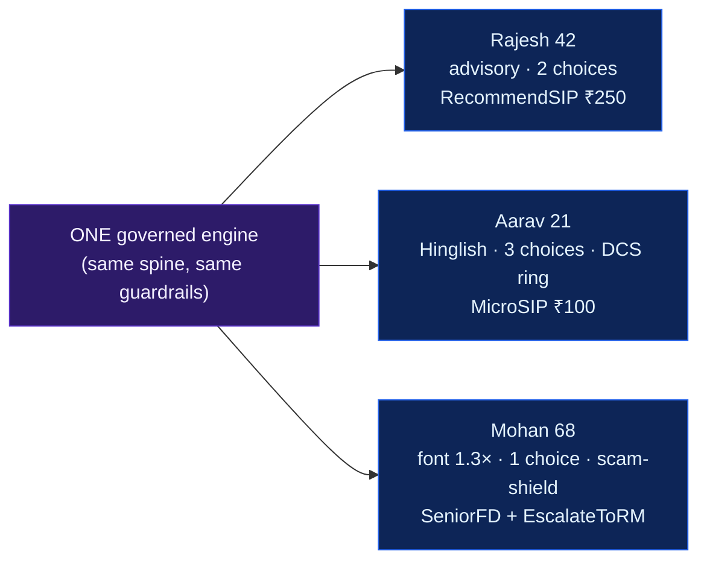
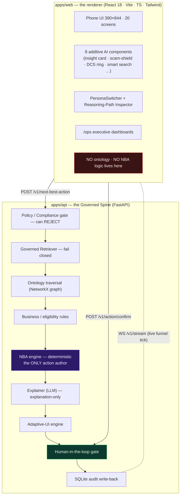
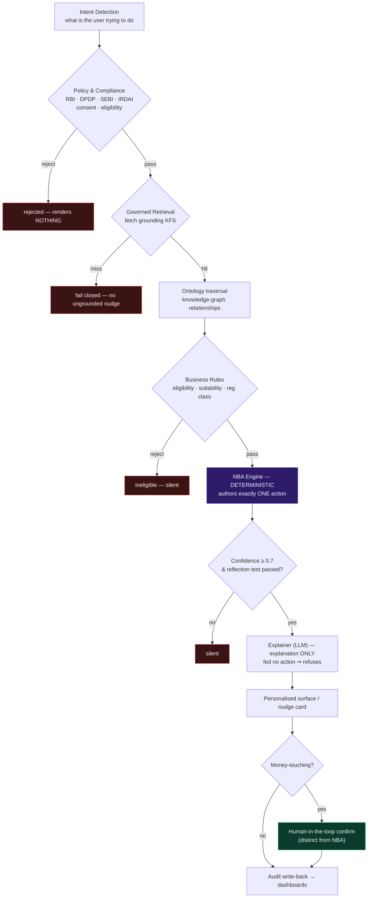
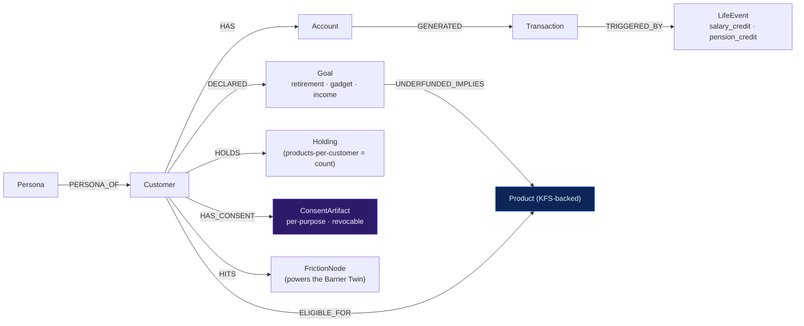
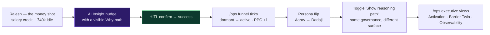

<div align="center">


<br/>

# KAUTILYA

**Intent → Governance → Next-Best-Action → Human Approval → Audit**

An agentic, explainable, human-in-the-loop **AI Intelligence Layer** over a faithful,
reverse-engineered SBI-YONO-style mobile banking UI. Kautilya does not *acquire* users —
it wakes up dormant ones and lifts products-per-customer, and it can prove every decision it makes.

<br/>

_"We don't acquire more users. We wake up the 9 crore you already have."_

<br/>

[](#quickstart)
[](#a-note-on-data--scope)
[](#the-governed-reasoning-spine--its-guardrails)

[](https://react.dev/)
[](https://www.typescriptlang.org/)
[](https://vitejs.dev/)
[](https://tailwindcss.com/)
[](https://fastapi.tiangolo.com/)
[](https://networkx.org/)
[](https://www.framer.com/motion/)

</div>

---

> **Every surfaced action is authored by a deterministic engine, gated by policy, grounded in a
> knowledge graph, and — if it touches money — held behind a human approval.** The language model
> only ever *explains*; it can never *decide*. Governance is enforced by the **architecture**, not by
> trusting the UI.

> **On the name.** *Kautilya* (Chāṇakya) authored the **Arthaśāstra**, India's foundational treatise
> on statecraft, economics, and prudent counsel. The engine is named for the advisor, not the ruler —
> it counsels, it grounds every word in evidence, and the human always makes the call.

---

## Table of contents

- [Overview](#overview) · [Why this is different](#why-this-is-different) · [The one thing that wins the room](#the-one-thing-that-wins-the-room)
- [Architecture](#architecture-the-backend-thinks-the-frontend-renders) · [Repository layout](#repository-layout) · [The governed reasoning spine](#the-governed-reasoning-spine--its-guardrails)
- [The three hero personas](#the-three-hero-personas) · [The Ontology — the moat](#the-ontology--the-moat) · [The engines](#the-engines)
- [Real YONO features](#real-yono-features-each-with-its-ai-layer) · [The three-act demo](#the-three-act-demo)
- [Quickstart](#quickstart) · [The `/v1` API contract](#the-v1-api-contract) · [Feature matrix](#feature-matrix)
- [Technology stack](#technology-stack) · [Design system](#design-system) · [A note on data & scope](#a-note-on-data--scope)
- [Roadmap](#roadmap) · [Acknowledgements](#acknowledgements) · [License](#license)

---

## Overview

SBI-YONO already has one of the largest registered user bases on earth — and a vast fraction of it is
**dormant**: registered, logged in once, never adopted a second product. The hard problem is not
acquisition. It is **activation under regulation**: nudging the right customer toward the right
product, in language they trust, without ever crossing the RBI / SEBI / IRDAI / DPDP lines that a
naive "AI recommends financial products" feature would trample.

**Kautilya is the intelligence layer that solves activation as a governance problem.** One governed
engine reads a customer's synthetic financial ontology, decides whether it is even *allowed* to act,
authors exactly one next-best-action, has a language model explain (never decide) it, and holds any
money-touching action behind a human approval — logging the full lineage of every step. The same
engine drives a pixel-faithful YONO-style phone app and a suite of executive `/ops` dashboards.

The demo's punchline: **one governed spine, three radically different but perfectly appropriate
experiences**, switchable live.

---

## Why this is different

Most "AI in banking" demos bolt a chatbot onto a UI and hope the model behaves. Kautilya makes
misbehaviour **structurally impossible** and turns the guardrails themselves into the product.

| | Typical "AI copilot" demo | **Kautilya** |
|---|---|---|
| Who authors an action | the LLM, in free text | a **deterministic NBA engine** — the *only* author of an action |
| Role of the LLM | decides *and* explains | **explanation-only** — fed an action, it refuses to originate one |
| Compliance | prompt-engineered "please be compliant" | a **policy gate that runs before the NBA** and can `REJECT`, rendering nothing |
| Grounding | model's parametric memory | **governed retrieval** — no KFS document ⇒ fail closed, no nudge |
| Money actions | model can "confirm" | a **distinct human-in-the-loop gate** (`/v1/action/confirm`) the model cannot reach |
| Personalisation | prompt hacks | an **AdaptiveUIProfile derived server-side** from `Persona × DCS × Screen` |
| Auditability | none | every authored / confirmed / rejected action logged with full lineage (DPDP-minimised) |
| Failure mode | hallucinated advice | AI slot **collapses silently**; the non-AI app still works |

The thesis in one line: **a governed reasoning spine where separation of duties is enforced by the
architecture — the model proposes nothing, grounds everything, and the human approves anything that
moves money.**

---

## The one thing that wins the room

**One governed engine produces three radically different, perfectly appropriate experiences** for
three live personas — flip between them in real time with the persona switcher:

| Persona | Who | Surfaced action | How the UI adapts |
|---|---|---|---|
| **Rajesh, 42** | mid-career, ₹40k idle surplus | `RecommendSIP` (₹250) + `OfferTermCover` | formal / advisory, **2** choices |
| **Aarav, 21** | college student | `RecommendMicroSIP` (₹100) + `SuggestCreditBuilder` | Hinglish, gamified **DCS ring + streak**, **3** choices |
| **Mohan "Dadaji", 68** | senior pensioner | `SuggestSeniorFD` + `ScamShieldAlert` + `EscalateToRM` | font **1.3×**, spacious, high-contrast, **1** choice |

The **reasoning path and governance are identical** across all three — only the surfaced action and
its presentation adapt. Toggle **"Show reasoning path"** to watch the same governed spine
(`Intent → Policy → Retrieval → Ontology → Rules → NBA → Explainer → HITL`) light up for every persona.



---

## Architecture: the backend thinks, the frontend renders



The governed reasoning spine, the ontology, and every guardrail live **server-side** so that *"the
model can't author a recommendation"* and *"money actions pass a human gate"* are enforced by the
**architecture**, not by trusting the UI. The frontend can never construct an action — it **requests**
one, **renders** the one the backend authored, and **POSTs** the human's approval back. Backend down?
`VITE_MOCK=1` serves bundled fixtures — still no client-authored recommendations.

---

## Repository layout

```
KAUTILYA/
├── package.json · pnpm-workspace.yaml     # pnpm workspace root (delegates to apps/web)
├── README.md · Master2.0 (1).md           # this file + the full design report
├── kautilyalogo.png
│
├── apps/
│   ├── web/                               # React 18 · Vite 5 · TS · Tailwind — the renderer
│   │   └── src/
│   │       ├── App.tsx · main.tsx         # routes: /app/* phone · /ops dashboards
│   │       ├── tokens/tokens.css          # design tokens (CSS variables)
│   │       ├── components/
│   │       │   ├── atoms/ molecules/ organisms/   # SBI design-system primitives
│   │       │   ├── ai/                     # 8 additive AI components (purple = AI only)
│   │       │   ├── PersonaSwitcher …       # DCSRing · ReasoningPathInspector · PhoneFrame
│   │       │   └── DemoShell.tsx           # the persona stage
│   │       ├── screens/                    # 20 YONO screens (Home · PayHub · Invest · YonoCash …)
│   │       ├── ops/                        # Activation · BarrierTwin · Observability · Admin
│   │       ├── persona/ store/             # PersonaSwitcher · Zustand (UI state ONLY)
│   │       └── api/                        # client · types · mockFixtures (VITE_MOCK)
│   │
│   └── api/                               # FastAPI — the Governed Spine (SYNTHETIC)
│       └── app/
│           ├── main.py · contracts.py      # /v1 endpoints + Pydantic contracts
│           ├── spine/                       # policy_engine · retriever · nba · explainer · graph
│           ├── ontology/                    # GraphPort · EmbeddedGraph (NetworkX)
│           │   ├── schema.cypher · seed.cypher       # Neo4j credibility artifacts
│           │   └── reasoning_paths.py · seed_synthetic.py
│           ├── engines/                     # dcs · barrier_twin · intervention · metrics
│           ├── adaptive/adaptive_ui.py      # deriveAdaptiveUIProfile(persona, dcs, screen)
│           ├── audit/audit_store.py         # SQLite model-register (full lineage)
│           └── tests/test_guardrails.py     # the invariants that FAIL the build
│
├── data/synthetic/                        # synthetic seed data
└── docs/                                  # architecture · ontology · personas · yono_features · demo_script
```

---

## The governed reasoning spine & its guardrails

Every hop is logged and rendered live in the **reasoning-path inspector**:



**Separation of duties is structural.** The NBA node *proposes*; the `/v1/action/confirm` endpoint
*approves*. The explainer is downstream and cannot originate. The policy engine runs *before* the NBA
node, so a model can never author a recommendation for a user it is not allowed to act for.

The guardrail suite (`apps/api/tests/test_guardrails.py`) is designed to **fail the build** if any
invariant breaks:

| Test | Invariant |
|---|---|
| `test_no_advice` | NBA never emits an `advice_prohibited` action (SEBI RIA boundary) |
| `test_policy_gate` | missing consent ⇒ `rejected`, renders nothing |
| `test_retrieval_fail_closed` | no grounding KFS ⇒ no nudge |
| `test_confidence_gate` | confidence < 0.7 or failed reflection test ⇒ silent |
| `test_hitl` | every money-touching verb requires a human approval before write-back |
| `test_explainer_is_explanation_only` | fed no action, the explainer refuses |
| `test_audit_completeness` / `test_dpdp_minimisation` | full lineage, banded inputs only |

Three reject paths are demonstrable live: `cust_reject_consent`, `cust_reject_eligibility`,
`cust_reject_retrieval`.

---

## The three hero personas

One engine, one design system, three lived-in experiences — each seeded at a fixed `SYNTHETIC` id so
the demo is deterministic. The `AdaptiveUIProfile` is **derived server-side** from
`Persona × DCS × ScreenContext` (`apps/api/app/adaptive/adaptive_ui.py`); the frontend only reads it.

| Lever | **Aarav** (21) | **Rajesh** (42) | **Mohan** (68) |
|---|---|---|---|
| archetype | `young_student` | `mid_career` | `senior` |
| `font_scale` | 1.0 | 1.0 | **1.3** |
| `density` | comfortable | comfortable | **spacious** |
| `contrast_mode` | standard | standard | **high** |
| `max_choices` | 3 | 2 | **1** |
| `copy_tone` | playful / motivational | respectful / advisory | warm / protective |
| register | Hinglish | formal bilingual | simple reassuring (Hindi) |
| structural | — | — | **SimplifyUI** (bigger targets, one CTA) |
| surfaced NBA | MicroSIP ₹100 + CreditBuilder | SIP ₹250 + TermCover | SeniorFD 7.50% + ScamShield + EscalateToRM |

> **Rajesh (the money shot):** *"₹40,000 has been sitting idle since your salary credit — about
> ₹1,400/yr in lost interest (illustrative). A ₹250/day SIP moves your retirement goal from 30%
> toward on-track."* — grounded, reflection-tested, held behind the HITL gate.

The reasoning path is **identical** across all three; only the surfaced action and its presentation
adapt. See [`docs/personas.md`](docs/personas.md).

---

## The Ontology — the moat

The **Ontology of the Customer's Financial Life**: a traversable knowledge graph where consent,
persona-adaptation, interventions and audit are **first-class nodes** — structural, not bolted on.
Implemented behind a `GraphPort` interface with an `EmbeddedGraph` (NetworkX) default; a real Neo4j
is a one-file swap. `schema.cypher` / `seed.cypher` ship as credibility artifacts.



**Governed action verbs** — each declares its `nba_class`, `regulatory_class`, and whether it is
money-touching. **Money-touching ⇒ `human_in_loop` always. No verb is ever `advice_prohibited`.**

```
RecommendSIP · RecommendMicroSIP · OfferTermCover · SuggestFD · SuggestSeniorFD
ReactivateAccount · SimplifyUI · SurfaceKFS · EscalateToRM · SuggestCreditBuilder · ScamShieldAlert
```

`seed_synthetic.build_graph()` seeds the 3 hero personas + 3 reject fixtures + **~10,000** generated
customers (seeded RNG → deterministic), giving the Barrier Twin a populated friction distribution and
the funnel a dormant-heavy cohort that **moves** when a nudge is confirmed. See
[`docs/ontology.md`](docs/ontology.md).

---

## The engines

Server-side engines under `apps/api/app/engines/` — the analytical brains behind the dashboards:

| Engine | What it computes |
|---|---|
| **DCS** — Digital Confidence Score | per-domain adoption confidence (Payments / Investments / Credit) that drives both the persona's gamified ring and the adaptive profile |
| **Adoption Barrier Twin** | a digital twin of where customers get *stuck* — friction-node distribution across screens, cohort share, severity |
| **Intervention** | wraps an NBA into an `Intervention` node with `reflection_test_passed` + `confidence` (never renders if the reflection fails or confidence < 0.7) |
| **Metrics** | activation-funnel + AI-observability aggregates that back the `/ops` dashboards |

The `/ops` desktop app surfaces four executive views: **Activation Dashboard**, **Adoption Barrier
Twin**, **AI Observability**, and **Admin**.

---

## Real YONO features (each with its AI layer)

Built from the real SBI-YONO feature set — every screen reads the persona's `AdaptiveUIProfile`, so
the senior gets the simplified/large-type treatment automatically. All **SYNTHETIC**.

| Real YONO feature | Screen | AI layer woven in |
|---|---|---|
| **YONO Cash** — cardless ATM withdrawal | `YonoCash.tsx` | **Scam-Shield** banner (severity escalates for the senior) — "never share this code" |
| **YONO Pay hub** — Scan & Pay, Quick Pay, Bharat QR | `PayHub.tsx` | persona recipient-suggestion chip — "you usually send ₹5,000 rent to Priya today" |
| **Scan & Pay** — UPI / Bharat QR scanner | `ScanPay.tsx` | — (AI stays out of the critical path) |
| **Investments hub** — MF/SIP, FD, Insurance, NPS | `Investments.tsx` | the engine-authored **SIP / MicroSIP / SeniorFD nudge** completes through the **HITL gate**; "Why am I seeing this?" shows the reasoning path |
| **Bill Pay & Recharge** — BBPS + FASTag | `BillPay.tsx` | **AI bill bundling** — "3 bills, ₹2,689 due this week — pay all" |
| **Insta Loan (PAPL)** — pre-approved, EMI slider | `InstaLoan.tsx` | persona/DCS-adaptive eligibility: ₹8.4L for mid-career, a **credit-builder path** for the student (never shaming), **branch-assist** for the senior |
| **YONO Shop** — 100+ merchants | `Marketplace.tsx` | **AI relevance filter** — only contextually-relevant offers show |
| **YONO Rewardz** — points, earn & redeem | `Rewards.tsx` | **adoption-reward** points for *adoption* behaviours (start a SIP), never for spending — tied to the DCS streak |
| **Fixed Deposits** — portfolio, new FD, senior variant | `FD*.tsx` | `AIMaturityCountdown` ribbon + senior-FD highlight |

See [`docs/yono_features.md`](docs/yono_features.md).

---

## The three-act demo

See [`docs/demo_script.md`](docs/demo_script.md). In short:



1. **Rajesh (the money shot):** salary credit + ₹40k idle → AI Insight nudge with a visible Why-path →
   HITL confirm → success → `/ops` funnel ticks dormant→active, products-per-customer +1.
2. **Persona flip:** switch to Aarav (gamified ₹100 micro-SIP), then Dadaji (senior FD, scam-shield,
   branch escalation). Toggle "Show reasoning path": *same governance, different surface*.
3. **Executive:** `/ops` → Activation Dashboard → Adoption Barrier Twin → AI Observability.

---

## Quickstart

Two terminals, no Docker. The **frontend runs standalone** on bundled fixtures; the **governed spine**
is the FastAPI service it talks to.

```bash
# ── Terminal 1 · frontend (the renderer) ──────────────────────────────
pnpm install
pnpm dev                         # http://localhost:5173  → the demo stage
#   /ops                         # http://localhost:5173/ops → executive dashboards

# Backend down (or for a pure-frontend demo)? Bundled fixtures, no server:
VITE_MOCK=1 pnpm --filter web dev
```

```bash
# ── Terminal 2 · the Governed Spine (FastAPI) ─────────────────────────
cd apps/api
uv sync
uv run fastapi dev               # http://localhost:8000  (seeds the graph + audit on first run)

# guardrail tests — the invariants that gate the build
uv run pytest
```

> **Windows / pnpm note:** if pnpm reports an ignored build script for `esbuild`, the repo already
> sets `allowBuilds: { esbuild: true }` in `pnpm-workspace.yaml`; re-run `pnpm install`.

| Command (from repo root) | Purpose |
|---|---|
| `pnpm install` | install the frontend workspace |
| `pnpm dev` | Vite dev server on `:5173` (proxies `/v1` → `:8000`) |
| `pnpm build` | type-check + production build of `apps/web` |
| `VITE_MOCK=1 pnpm --filter web dev` | run the FE on bundled fixtures (no backend) |
| `cd apps/api && uv run fastapi dev` | run the governed spine on `:8000` |
| `cd apps/api && uv run pytest` | run the guardrail suite |

---

## The `/v1` API contract

The seam between the renderer and the spine. **The frontend can never construct an action** — it
requests one, renders the one the backend authored, and POSTs the human's approval back.

| Endpoint | Returns |
|---|---|
| `GET /v1/customer/{id}` | DPDP-minimised projection (**bands only**, never raw values) |
| `GET /v1/adaptive-profile/{id}?screen=` | `AdaptiveUIProfile` — density, font_scale, register, max_choices, tone |
| `POST /v1/next-best-action` | runs the full spine → `recommend` · `rejected` · `silent` |
| `POST /v1/action/confirm` | the **HITL gate** → write-back + dashboard delta |
| `GET /v1/ops/{activation,barriers,observability}` | executive dashboard aggregates |
| `WS /v1/stream` | live funnel / DCS tick on confirm |

Contracts are Pydantic models in `apps/api/app/contracts.py`; the TypeScript mirror lives in
`apps/web/src/api/types.ts`.

---

## Feature matrix

| Capability | Typical AI-copilot demo | **Kautilya** |
|---|---|---|
| Action authorship | LLM free-text | deterministic NBA engine (sole author) |
| Compliance | prompt instruction | policy gate *before* NBA, can `REJECT` |
| Grounding | parametric memory | governed retrieval, fail-closed |
| Money actions | model "confirms" | distinct human-in-the-loop gate |
| Personalisation | prompt hacks | server-derived `AdaptiveUIProfile` |
| Explainability | mixed with decision | explanation-only LLM + reasoning-path inspector |
| Audit | none | full lineage, DPDP-minimised, SQLite register |
| Graceful degradation | hallucinates | AI slot collapses silently; app still works |
| Accessibility | afterthought | WCAG AA (AAA on auth/transfer), 200% font survival |
| Persona range | one | three live archetypes, same spine |

---

## Technology stack

| Layer | Technology |
|---|---|
| **Frontend** | React 18 · TypeScript 5 · Vite 5 · pnpm workspaces |
| **Styling** | Tailwind CSS 3 · CSS custom-property design tokens (`tokens.css`) |
| **Motion** | Framer Motion (persona morph, `prefers-reduced-motion` honoured) |
| **FE state** | Zustand — **UI state only** (active persona, toggles, dismissals) |
| **Routing** | React Router v6 |
| **Backend** | Python 3.11+ · FastAPI · Pydantic v2 · Uvicorn · WebSockets |
| **Knowledge graph** | NetworkX `EmbeddedGraph` behind a `GraphPort` (Neo4j-swappable) |
| **Audit** | SQLite model-register |
| **Explainer** | deterministic template by default; `EXPLAINER_BACKEND=anthropic` for the real Anthropic adapter (still explanation-only) |
| **Tooling** | `uv` (Python) · `pytest` guardrails |

---

## Design system

The interface reads as **trustworthy Indian retail banking** — SBI-inspired, not a brand clone. Every
AI surface is **additive and dismissible**; killing the AI layer (Profile → AI Preferences) leaves a
fully working non-AI app. Tokens live in [`apps/web/src/tokens/tokens.css`](apps/web/src/tokens/tokens.css).

| Token group | Values |
|---|---|
| **Brand blue** | `#2563eb` · `#1a3f7a` · `#15347a` · `#0d2557` |
| **AI-only (purple)** | primary `#5c35cc` · secondary `#7c3aed` · surface `#f3f0ff` · on-surface `#2d1b69` |
| **Semantic** | success `#2e7d32` · alert `#c62828` · warn `#f57f17` |
| **Type** | Inter (UI) · **Noto Sans** (Devanagari + Latin, for the senior's Hindi register) |
| **Adaptation** | the whole tree rescales from one CSS var (`--font-scale`) — the senior 1.3× is a single knob |

**Six enforced tenets:** augment (don't replace) · trust through consistency (purple = AI only) · low
surprise, high delight · graceful degradation · explain, don't assert · accessible first (WCAG AA,
AAA on auth/transfer, 48dp targets, 200% font survival). See [`docs/architecture.md`](docs/architecture.md).

---

## A note on data & scope

Everything here is **100% SYNTHETIC**. No real SBI proprietary assets, logos, or customer data. The
style is *"SBI-inspired"*, not a clone of brand assets. All customers, transactions, balances and
personas are generated from a seeded RNG for a deterministic demo. Balances and inputs are handled as
**bands, not raw values** (DPDP data-minimisation), and every AI-authored action is logged with full
lineage. The interest / return figures in nudges are **illustrative**, and the word *"confirmed"*
never sits next to financial advice — the model explains, the human decides.

Further reading: [architecture](docs/architecture.md) · [ontology](docs/ontology.md) ·
[personas](docs/personas.md) · [YONO features](docs/yono_features.md) · [demo script](docs/demo_script.md) ·
and the full design report, `Master2.0 (1).md`.

---

## Roadmap

- **Graph backend** — flip `GraphPort` from `EmbeddedGraph` to a real Neo4j `neo4j_adapter.py` with
  zero caller changes (`schema.cypher` / `seed.cypher` already ship).
- **Live explainer** — route the explanation layer through the Anthropic adapter
  (`EXPLAINER_BACKEND=anthropic`) while keeping it strictly explanation-only.
- **More personas & verbs** — extend the archetype set and the governed action-verb contracts.
- **Real telemetry** — wire the `/ops` funnel and Barrier Twin to live (still synthetic) event streams.

---

## Acknowledgements

- **SBI YONO** — the real feature set that inspired the reverse-engineered UI (all assets synthetic).
- **RBI · SEBI · IRDAI · DPDP** — the regulatory boundaries the governance layer is designed around.
- **Kautilya (Chāṇakya)** — the *Arthaśāstra*, for the name and the ethos: counsel grounded in evidence.

---

## License

Private / demonstration project. All data **SYNTHETIC**. No real SBI customer data, ever.

<div align="center">
<br/>
<sub><b>KAUTILYA</b> — YONO Adoption Copilot · Intent → Governance → Next-Best-Action → Human Approval → Audit</sub>
</div>
