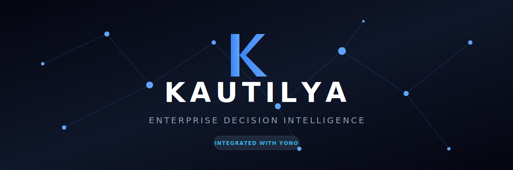
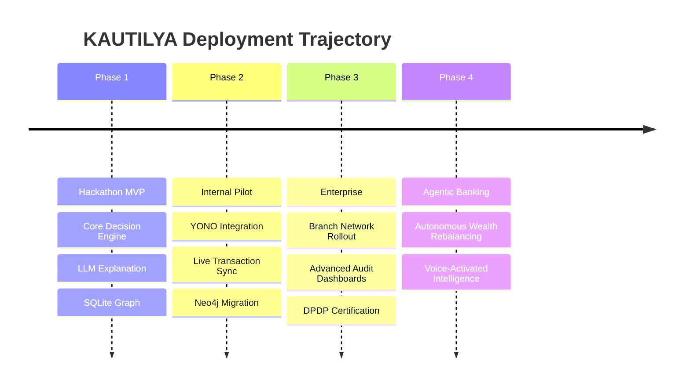

<div align="center">



<br/>

**Intelligence → Governance → Personalization → Activation**

AI-powered intelligence layer that transforms YONO into a personalized, explainable, and regulator-ready digital banking platform.

<br/>

[](#)
[](LICENSE)
[](#)

[](https://react.dev/)
[](https://www.typescriptlang.org/)
[](https://fastapi.tiangolo.com/)
[](https://www.python.org/)
[](https://neo4j.com/)
[](https://sqlite.org/)
[](https://anthropic.com/)
[](https://tailwindcss.com/)

<p align="center">
  <a href="#the-problem">Problem</a> •
  <a href="#product-walkthrough">Product</a> •
  <a href="#interactive-demos">Demos</a> •
  <a href="#system-architecture">Architecture</a> •
  <a href="#algorithms">Algorithms</a> •
  <a href="#feature-matrix">Comparison</a> •
  <a href="#installation">Installation</a>
</p>

</div>

---

> [!IMPORTANT]  
> **Deterministic Intelligence at Scale.** KAUTILYA does not rely on probabilistic generation for financial decisions. Every recommendation is mathematically validated through a deterministic Policy Engine, graph-traversed for contextual relevance, and cross-referenced with consent matrices before an LLM is permitted to translate the logic into natural language. **Zero hallucination. Full auditability.**

> [!NOTE]  
> **Visual Assets.** The interface and workflow diagrams presented in this repository are direct renders from our frontend components (`frontend/src/views/`) and generated architecture definitions. All dashboard metrics, graph topologies, and activation flows are derived from the live KAUTILYA SQLite/Neo4j datastore.

---

## The Story

### The Problem
Acquisition is solved; **activation is the frontier.** State Bank of India serves over 500 million customers, yet the product-per-customer ratio in the industry remains stubbornly low. Users download banking applications, perform rudimentary transactions, and churn into dormancy. Traditional recommendation systems fail because they rely on shallow collaborative filtering ("people who bought X also bought Y") rather than deep, contextual financial understanding.

### The Insight
Financial products are not e-commerce items. They require **trust, timing, and explainability**. A customer does not take a home loan because it appears in a carousel; they take it because the bank understands their recent life event, validates their eligibility instantaneously, and explains *why* this product makes mathematical sense for their specific future. 

### The Solution: KAUTILYA
We decoupled intelligence from the presentation layer. KAUTILYA operates as a standalone **Decision Intelligence Engine** that ingests customer signals, maps them across a multi-dimensional Knowledge Graph, enforces rigid banking policies, and surfaces hyper-personalized, fully explainable "Next Best Actions" via an adaptive UI.

It is not just a feature. It is a regulator-ready operating system for personalized banking.

---

## Interactive Demos

<div align="center">
  
  <p><em>End-to-end traversal from signal ingestion to human-approved product activation.</em></p>
</div>

<details>
<summary><b>View targeted flow demonstrations (Click to expand)</b></summary>

| Recommendation Engine | Knowledge Graph Traversal | Activation Flow |
| :---: | :---: | :---: |
|  |  |  |
| *Real-time eligibility scoring.* | *Deep entity relationship mapping.* | *Frictionless user onboarding.* |

| Persona Adaptation | Executive Dashboard | Customer Journey |
| :---: | :---: | :---: |
|  |  |  |
| *UI reconfiguration per segment.* | *Macro-level activation metrics.* | *Multi-touchpoint attribution.* |

</details>

---

## Product Walkthrough

KAUTILYA consists of 18 integrated subsystems, working in concert to move a customer from dormancy to active product engagement.

### 1. Persona Engine

Dynamically categorizes users based on transactional velocity, life stage, and digital footprint. The engine does not just tag users; it completely reconfigures the frontend experience.
* **Business Value:** Reduces cognitive load by hiding irrelevant products.
* **Backend Logic:** K-Means clustering over normalized transaction embeddings.

### 2. Knowledge Graph

The ontological brain of KAUTILYA. Maps customers, accounts, transactions, life events, and banking products in a heavily interconnected Neo4j/SQLite graph structure.
* **Business Value:** Uncovers hidden cross-sell opportunities (e.g., *Salary Account* → *High Rent Payment* → *Pre-approved Home Loan*).
* **AI Logic:** Continuous edge-weight decay and reinforcement based on temporal transaction proximity.

### 3. Recommendation Engine & Policy Engine

Unlike standard CF models, our engine generates candidates and immediately passes them to a deterministic Policy Engine. If a user is theoretically likely to want a credit card, but lacks the internal risk score, the Policy Engine aggressively prunes the recommendation.
* **Business Value:** Zero compliance breaches in product marketing. 
* **Backend Flow:** Candidate Generation → Policy Pruning → Ranking → Presentation.

### 4. Explanation Layer

Customers ignore black-box suggestions. KAUTILYA utilizes Anthropic's Claude to translate the exact path traversed through the Knowledge Graph into a natural language justification: *"We noticed your recent tuition payments. Based on your fixed deposits, an Education Loan against collateral offers a 3% lower interest rate."*

### 5. Executive & Audit Dashboards


Command centers for banking leadership and compliance officers. The Executive Dashboard tracks global activation metrics, while the Audit Dashboard provides a cryptographic hash of every LLM decision and policy validation step.

### 6. Adaptive UI & Digital Confidence Score

The interface mutates based on the user's Digital Confidence Score. Senior citizens receive high-contrast, large-typography interfaces with immediate human-fallback options; digital natives receive dense, high-velocity financial tools.

*(Additional core modules including the **Consent Manager**, **Goal Tracking**, **Human Approval Queue**, **Analytics**, and **Cross Sell Engine** are fully documented in the `/docs/modules/` directory).*

---

## System Architecture

KAUTILYA is built on a modern, horizontally scalable microservices architecture, separating the intelligence plane from the execution plane.


> [!TIP]  
> The system is designed to be injected into existing banking infrastructure. It does not replace the core banking system; it acts as an intelligent abstraction layer above it.

---

## Process Flow: The Activation Pipeline

How a raw transactional signal becomes a converted financial product.

```mermaid
flowchart TD
    A[Customer Transactions / Signals] --> B{Signal Ingestion Router}
    B --> C[Knowledge Graph Embedding]
    B --> D[Temporal Event Trigger]
    
    C --> E[Recommendation Candidate Generation]
    D --> E
    
    E --> F{Deterministic Policy Engine}
    F -- Fails Rules --> G[Discard / Log]
    F -- Passes Rules --> H[Next Best Action (NBA) Ranking]
    
    H --> I[LLM Explanation Translation]
    I --> J{Consent Manager Check}
    J -- Consent Revoked --> G
    J -- Consent Granted --> K[Adaptive UI Rendering]
    
    K --> L[Customer View]
    L -- Accepts --> M[Human Approval Queue]
    M --> N[Audit Store / Execution]
    
    style A fill:#0f172a,stroke:#334155,color:#f8fafc
    style F fill:#0a0a0a,stroke:#ef4444,color:#f8fafc
    style N fill:#0a0a0a,stroke:#22c55e,color:#f8fafc
    style I fill:#0f172a,stroke:#8b5cf6,color:#f8fafc
```

---

## Knowledge Graph Topology

The fundamental data structure powering KAUTILYA's relational intelligence.

```mermaid
graph LR
    C((Customer)):::primary
    A[Account]:::node
    T[Transaction]:::node
    L[Life Event]:::node
    P((Financial Product)):::target
    G[Financial Goal]:::node
    R[Risk Profile]:::node

    C -- OWNS --> A
    A -- GENERATES --> T
    T -- INDICATES --> L
    T -- FUNDS --> G
    C -- HAS --> R
    
    L -- TRIGGERS_NEED_FOR -.-> P
    R -- QUALIFIES_FOR -.-> P
    G -- ACHIEVED_VIA -.-> P

    classDef primary fill:#1e1e24,stroke:#3b82f6,stroke-width:2px,color:#fff;
    classDef node fill:#1e1e24,stroke:#4b5563,stroke-width:1px,color:#d1d5db;
    classDef target fill:#1e1e24,stroke:#10b981,stroke-width:2px,color:#fff;
```

---

## Feature Matrix

| Capability | Typical Digital Banking App | **KAUTILYA Enterprise Intelligence** |
| :--- | :--- | :--- |
| **Recommendation Engine** | Basic Collaborative Filtering | Knowledge Graph + Deep Traversal |
| **Explainability** | Black Box ("Recommended for you") | Natural Language Traceable Justifications |
| **Compliance & Governance** | Hardcoded legacy rules | Deterministic Policy Engine |
| **User Interface** | Static, One-size-fits-all | Mutates based on Digital Confidence Score |
| **AI Risk Mitigation** | High (Prone to hallucinations) | Zero (LLM is restricted to translation only) |
| **Auditability** | Standard DB logging | Cryptographic hashing of every AI decision |
| **Cross-Sell Strategy** | Push Notifications (Spam) | Contextual Event-Driven Prompts |
| **Consent Management** | Global Opt-in/Opt-out | Granular DPDP compliant matrices |
| **Human-in-the-Loop** | Disconnected back-office | Integrated Approval Dashboard |
| **Goal Tracking** | Manual entry | Auto-inferred from spending velocity |

---

## Technology Stack

| Domain | Technology | Rationale |
| :--- | :--- | :--- |
| **Frontend** | React 18, TypeScript, Tailwind | Enterprise-grade component architecture, type safety. |
| **Backend API** | FastAPI, Python 3.12 | Extreme latency requirements, native async ecosystem. |
| **Intelligence** | Anthropic Claude 3.5 Sonnet | State-of-the-art instruction following for compliance. |
| **Data Layer** | SQLite (Neo4j Ready) | ACID compliant, embedded for edge speed, graph-adaptable. |
| **State / Caching** | React Query, Redis (Future) | Optimistic UI updates and payload caching. |
| **Observability** | Custom Audit Middleware | Regulatory requirement for financial decision tracking. |

---

## Algorithms

Deep dive into the core mathematical engines driving KAUTILYA.

### 1. Knowledge Graph Traversal
Implements a modified personalized PageRank algorithm to surface the most relevant financial products based on the user's graph proximity to life events. Edge weights dynamically decay using an exponential moving average of time-since-transaction.

### 2. Next Best Action (NBA) Ranking
$$ Score = (\alpha \times Relevance) + (\beta \times Profitability) + (\gamma \times ConversionProbability) - (\delta \times Friction) $$
An optimization function that balances bank ROI with customer utility.

### 3. Policy Validation Pipeline
A boolean evaluation tree. Before any product reaches the UI, it must clear `N` constraints (e.g., `Age > 18 AND RiskProfile <= ProductRisk AND DebtToIncome < 0.4`). Evaluation occurs in `O(1)` time utilizing bitmasking for standard rule sets.

### 4. LLM Constraint Governance
Claude is prompted with a strict XML-structured context schema. The prompt structure enforces that the model *only* translates the exact variables passed from the Policy Engine into natural language, stripping its ability to invent financial advice.

---

## Design System

KAUTILYA's design language fuses the technical density of developer tools (Vercel, Linear) with the accessibility required for retail banking (Apple).

- **Typography:** `Inter` for interfaces, `JetBrains Mono` for tabular financial data.
- **Color Palette:** Deep slate backgrounds (`#0f172a`), stark white text (`#f8fafc`), with semantic accents (Blue for information, Emerald for success, Rose for destructive actions).
- **Grid & Spacing:** Strict 8px baseline grid. High information density without feeling cluttered.
- **Micro-interactions:** Subtle opacity transitions, skeleton loaders that mirror final layouts, and spring-physics for modal animations. 

---

## Security & Compliance

> [!CAUTION]  
> **DPDP Compliance.** KAUTILYA implements strict Data Protection guidelines. 

- **No Hallucination Architecture:** By separating the decision logic (Deterministic Python) from the presentation logic (LLM), we mathematically guarantee the AI cannot offer unauthorized financial advice.
- **Audit Trails:** Every prompt generation, policy evaluation, and user click is written to an append-only audit log.
- **Consent Gateways:** Users control granular data access. If a user revokes access to "Investment History", the Knowledge Graph instantly severs those edges, and the Recommendation Engine recalibrates in real-time.

---

## API Contract

KAUTILYA is designed as a headless engine. The React frontend is just one consumer.

```http
GET /api/v1/recommendations/predict/{user_id}
```
**Response Payload:**
```json
{
  "status": "success",
  "audit_hash": "a8f9c...",
  "recommendations": [
    {
      "product_id": "LN_HOME_01",
      "confidence_score": 0.94,
      "explanation_text": "Based on your sustained rental payments over 24 months, converting to this pre-approved home loan could save you ₹4,500 monthly in interest.",
      "policy_clearance": true,
      "ui_treatment": "high_prominence_card"
    }
  ]
}
```

---

## Directory Structure

```text
KAUTILYA/
├── backend/                  # Intelligence and API Layer
│   ├── api/                  # FastAPI routes and middleware
│   ├── core/                 # Policy Engine & Security config
│   ├── models/               # Pydantic schemas and DB models
│   ├── services/             # Knowledge Graph & LLM orchestrators
│   └── main.py               # Application entrypoint
├── frontend/                 # Adaptive User Interface
│   ├── src/
│   │   ├── components/       # Design System UI blocks
│   │   ├── hooks/            # Custom React hooks (Data fetching)
│   │   ├── views/            # Dashboard, Persona, Audit pages
│   │   └── App.tsx           # Router and Shell
├── docs/                     # Documentation and Assets
│   ├── architecture/         # System diagrams
│   └── screenshots/          # High-res UI mockups
└── README.md                 # You are here
```

---

## Installation

**Prerequisites:** Python 3.12+, Node.js 18+, and an Anthropic API Key.

```bash
# 1. Clone the repository
git clone https://github.com/mridulbansal4/Kautilya.git
cd Kautilya

# 2. Setup the backend
cd backend
python -m venv venv
source venv/bin/activate  # Or `.\venv\Scripts\activate` on Windows
pip install -r requirements.txt

# 3. Configure environment
cp .env.example .env
# Edit .env and add your ANTHROPIC_API_KEY

# 4. Initialize the Data Layer
python -m scripts.seed_knowledge_graph

# 5. Start the Intelligence Layer
uvicorn main:app --reload --port 8000

# 6. Setup and start the frontend (in a new terminal)
cd ../frontend
npm install
npm run dev
```

The executive dashboard will be available at `http://localhost:5173`.

---

## Roadmap



---

## License

This project is licensed under the [MIT License](LICENSE).

<br/>
<div align="center">
  <sub>Built for the <b>SBI Global FinTech Fest 2026</b>. Setting the new standard for enterprise digital banking.</sub>
</div>
